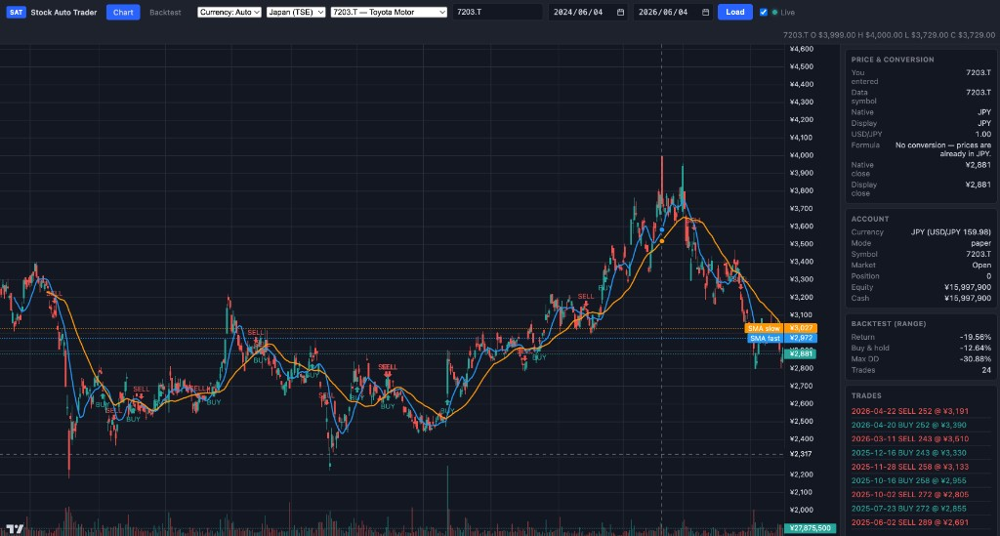
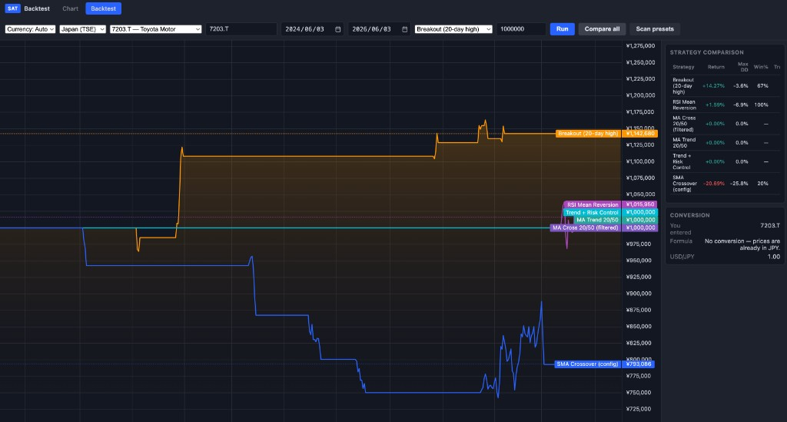

# stock-auto-trader

Python app for **US stock auto-trading on Alpaca** (SMA crossover) plus a **local web UI** for charting and **multi-strategy backtesting** on US and **Japan (TSE)** symbols.

> **Risk warning:** Automated trading can lose money quickly. This project is educational tooling, not financial advice. Test thoroughly on paper before using real money.

## Features

- **Live trading (US only):** SMA crossover on Alpaca paper or live accounts
- **Japan (TSE):** Daily bars from Yahoo Finance — chart and backtest only (no orders)
- **Web UI:** TradingView-style chart + dedicated backtest page ([Lightweight Charts](https://www.tradingview.com/lightweight-charts/))
- **Six backtest strategies** with compare-all and multi-symbol scan
- **USD / JPY** display with live or manual FX
- Risk limits, kill switch, and `LIVE_TRADING_CONFIRMED` guard for live orders
- **CLI:** `status`, `run-once`, `run`, `backtest`, `backtest-scan`, `chart`, `kill-switch`

## Screenshots

### Chart UI

Candlesticks, volume, SMA overlays, and buy/sell markers (Toyota `7203.T`, Japan TSE).



### Backtest — compare all strategies

Equity curves and strategy comparison table for the same symbol and date range.



## Quick start

### 1. Alpaca account (US trading)

1. Sign up at [https://alpaca.markets/](https://alpaca.markets/)
2. Create API keys (paper recommended first)
3. In `.env`: `TRADING_MODE=paper` and `ALPACA_BASE_URL=https://paper-api.alpaca.markets`

Japan-only chart/backtest can run **without** Alpaca keys (demo mode uses synthetic US data; Japan uses Yahoo when you pick a `.T` symbol).

### 2. Install

```bash
git clone https://github.com/Hungon/stock-auto-trader.git
cd stock-auto-trader
python3 -m venv .venv
source .venv/bin/activate   # Windows: .venv\Scripts\activate
pip install -e .
cp .env.example .env
# Edit .env with your API keys (optional for Japan backtest-only)
```

### 3. Check status (no orders)

```bash
stock-trader status
```

### 4. Web UI (chart + backtest)

```bash
stock-trader chart
```

| URL | Purpose |
|-----|---------|
| http://127.0.0.1:8765/ | Chart — candlesticks, SMAs, volume, live refresh |
| http://127.0.0.1:8765/backtest | Backtest — pick strategy, **Compare all**, or **Scan presets** |

Toolbar: market (Japan / US), symbol, date range, currency. Default end date is **yesterday** (today’s bar is often incomplete on Yahoo).

### 5. Live trading (US, careful)

With `LIVE_TRADING_CONFIRMED=no`, `run-once` evaluates signals but does **not** send orders:

```bash
stock-trader run-once
```

To enable live orders:

```env
TRADING_MODE=live
ALPACA_BASE_URL=https://api.alpaca.markets
LIVE_TRADING_CONFIRMED=yes
```

```bash
stock-trader run-once   # single tick
stock-trader run        # loop (Ctrl+C to stop)
```

Live loop uses the **SMA crossover** from `.env` (`FAST_SMA_PERIOD` / `SLOW_SMA_PERIOD`) on your `SYMBOL`. Backtest strategies are simulation-only.

## Backtest strategies

All strategies are long-only, fill at **bar close**, and share position limits from `.env` (Japan backtests scale cash/notional for yen). Strategies using **MA200** need ~200+ daily bars (use a range of at least ~2 years).

| ID | Summary |
|----|---------|
| `sma_crossover` | Fast/slow SMA cross from `.env` + volume filter; stop & trail |
| `ma_cross_20_50` | Golden cross 20/50 + MA200 + rising MA50; stops, trail, take-profit |
| `ma_trend_20_50` | Golden/death cross above MA200 with volume |
| `rsi_mean_reversion` | RSI oversold bounce above MA200; take-profit & stop |
| `breakout_20` | New 20-day high + volume in uptrend; trail & take-profit |
| `trend_risk_control` | Filtered golden cross + RSI band + volume; layered exits |

`pair_trading` and `multi_factor` are placeholders (need two symbols or a stock universe).

**Metrics:** return vs buy & hold, max drawdown, win rate, Sharpe, profit factor, exposure, trade list.

### CLI

```bash
# One strategy
stock-trader backtest --market jp --symbol 6758.T --strategy ma_cross_20_50

# All strategies on one symbol
stock-trader backtest --market jp --symbol 6758.T --compare

# All strategies × multiple symbols
stock-trader backtest-scan --symbols 6758.T,7203.T,SPY,AAPL

# Custom range (end before today avoids incomplete bars)
stock-trader backtest --start 2022-01-01 --end 2025-06-03 --symbol SPY

# Local CSV (timestamp/date + open,high,low,close,volume)
stock-trader backtest --csv ./data/spy.csv --symbol SPY
```

List strategy IDs: `GET http://127.0.0.1:8765/api/strategies` (with chart server running).

### Kill switch

```bash
stock-trader kill-switch --enable
stock-trader kill-switch --disable
```

## US vs Japan

| | **US (e.g. SPY, AAPL)** | **Japan (e.g. 7203.T)** |
|--|--|--|
| **Data** | Alpaca (API keys) | Yahoo Finance (`.T` tickers) |
| **Auto-trading** | Yes (paper/live) | No — chart & backtest only |
| **Symbol format** | `AAPL`, `SPY` | `7203.T` or `7203` (Toyota) |
| **Aliases** | — | e.g. `SONY` → `6758.T` when market is Japan |

```env
MARKET=jp
SYMBOL=7203.T
```

Popular presets are in the chart/backtest toolbar (Toyota, Sony, SoftBank, MUFG, Nintendo, etc.).

## Currency (USD / JPY)

Toolbar: **USD**, **JPY**, or **Auto** (JPY for Japan, USD for US). Cross-currency view uses Yahoo `USDJPY=X` unless overridden:

```env
DISPLAY_CURRENCY=auto
FX_USDJPY=150.0
```

## Configuration

| Variable | Description |
|----------|-------------|
| `ALPACA_API_KEY` / `ALPACA_SECRET_KEY` | Alpaca credentials (required for US live/backtest data) |
| `ALPACA_BASE_URL` | Must match `TRADING_MODE` |
| `ALPACA_DATA_FEED` | `iex` (free) or `sip` (paid) |
| `TRADING_MODE` | `live` or `paper` |
| `LIVE_TRADING_CONFIRMED` | `yes` to submit live orders |
| `MARKET` | `auto`, `us`, or `jp` |
| `SYMBOL` | Default ticker |
| `DISPLAY_CURRENCY` | `auto`, `usd`, or `jpy` |
| `FX_USDJPY` | Optional fixed JPY per 1 USD |
| `FAST_SMA_PERIOD` / `SLOW_SMA_PERIOD` | Live SMA crossover & `sma_crossover` backtest |
| `BAR_TIMEFRAME` | e.g. `1Day`, `5Min`, `1Min` |
| `LOOKBACK_BARS` | Bars fetched for live loop |
| `CHART_REFRESH_SECONDS` | Chart live refresh interval |
| `MAX_ORDER_NOTIONAL` / `MAX_POSITION_SHARES` | Risk caps |
| `POLL_INTERVAL_SECONDS` | Live loop delay |
| `BACKTEST_INITIAL_CASH` | US / default starting cash |
| `BACKTEST_INITIAL_CASH_JPY` | Optional yen starting cash |
| `BACKTEST_MAX_ORDER_NOTIONAL_JPY` | Optional per-buy cap in yen |

## Live trading logic (SMA only)

- **Buy** when fast SMA crosses above slow SMA (flat position)
- **Sell** when fast SMA crosses below slow SMA (long position)
- Uses configured `BAR_TIMEFRAME` (default daily)

## Disclaimer

You are responsible for compliance, taxes, and losses. Backtest results omit commission, slippage, and survivorship bias. Past performance does not predict future results.
